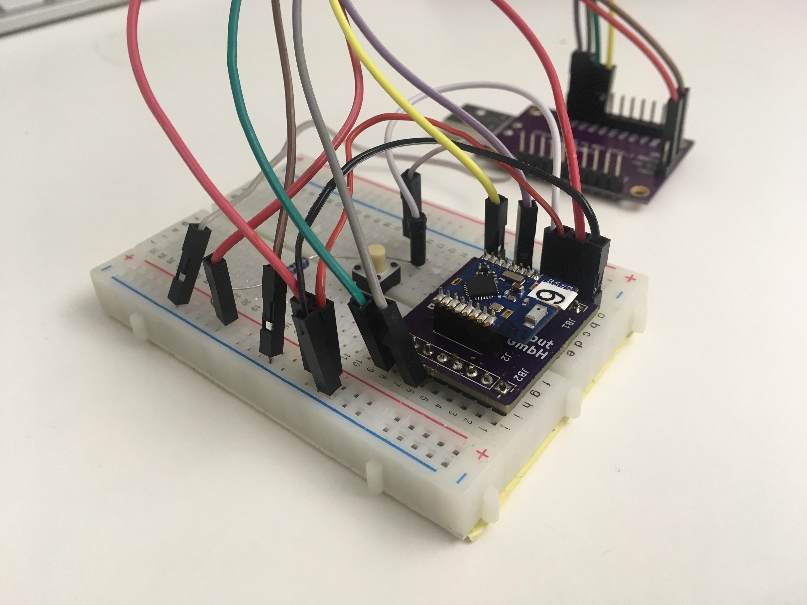

# Breakout Board for the EM9304 Module

The EM9304 module from the DVK has a 16-pin 0.05" header. To make it easier to connect it with jumper wires or plug it into a solderless breadboard, we've created a simple breakout board.

It is can be directly [ordered at OSHpark](https://oshpark.com/shared_projects/6OCoIZie)

